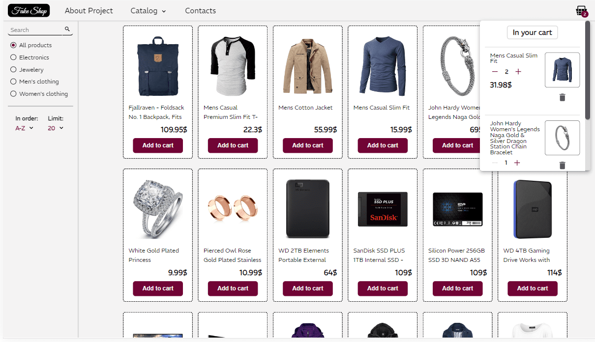

> I am a junior front-end developer.
>
> This pet project was created for my portfolio during my studies.

# Project 3: Fake online shop

This fake shop imitates real online shopping experience. You don’t pay, and you will never get your order, but all other things look and function quite the way they are supposed to.

Product objects are received from the external API. Cart and order logic is implemented using custom-built local Next.js API.

## Features

- **Navigate the catalog** using **filters** (category, name, limit) or type the product’s name in the **“search” field**;
- Click on a product to read the **full description**;
- **Add products** to **the cart**. In the cart you can **delete them, increase or decrease the amount** (the final **cost will be calculated** accordingly);
- Click “Go to checkout”, fill in the **delivery information** and **submit the order**;
- The project has **responsive layout** (available for devices ranging from **smartphones to large desktop** screens);
- All **UI** components are **custom-made**.

## Skills used

- Next.js
- Next.js API
- Postman
- Sass/Scss
- Redux
- Git + Bash
- ESLint

## What did I learn

- **Comprehensive** processing of **external API data**;
- Building a small **local Next.js API**;
- Using **Redux Toolkit** for **queries and data management**;
- Implementing a simple **search engine**;
- Creating and managing **URL hierarchy using Next Router**;
- Implementing **query-based catalog filtering**;
- Building **input forms** with thorough **validation**;
- Configuring **ESlint ruleset**;
- Implementing **‘Husky’ pre-commit check**.

Here you can check the <a href="https://main--dazzling-tulumba-1dafaa.netlify.app//" target="_blank">deployed site</a>!
